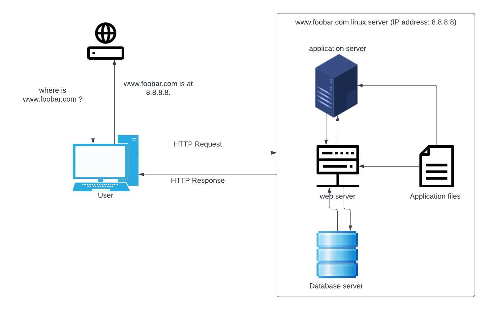

# Simple_Web_Stack

# Description
This is a simple web infrastructure that hosts a website that is reachable via `www.foobar.com`. There are no firewalls or SSL certificates for protecting the server's network. Each component (database, application server) has to share the resources (CPU, RAM, and SSD) provided by the server.

# some specifics about this infrastructure

+ What a server is ?

A server is a computer or a software system that provides services, resources, or functionality to other computers, programs, or devices, known as clients.

+ What is the role of the domain name ?

A domain name is a human-readable address used to identify a specific location on the internet. It serves as a memorable and easy-to-use name that corresponds to the numerical IP (Internet Protocol) address of a server hosting a website or other internet services.
The primary roles of a domain name are:
++ Identification
++ Identification
++ Branding
++ SEO (Search Engine Optimization)

+ What type of DNS record `www` is in `www.foobar.com`

In the domain name www.foobar.com, www is a subdomain. It does not have a separate DNS record type but is typically used to prefix websites. DNS records for www.foobar.com include A records (IPv4 address), AAAA records (IPv6 address), CNAME records (canonical name), MX records (mail exchange), and TXT records (text).

+ What is the role of the web server ?

The web server's role is to store, process, and deliver web pages and other content to clients (web browsers) that request them over the internet. It handles incoming requests, processes them, and sends back the requested resources, such as HTML pages, images, or files.

+ What is the role of the application server ?

The application server's role is to run and manage applications, providing services such as transaction management, security, and resource pooling. It acts as an intermediary between clients and backend databases or services, processing requests and generating dynamic content for web applications.

+ What is the role of the database ?

The database's role is to store, organize, and manage data for applications. It provides a structured way to store and retrieve data, ensuring data integrity, security, and efficiency. Applications use databases to store and retrieve information, such as user data, product information, or transaction records.

+ What is the server using to communicate with the computer of the user requesting the website ?

The server communicates with the user's computer using the HTTP (Hypertext Transfer Protocol) protocol. When a user requests a website, their web browser sends an HTTP request to the server, specifying the desired resource (e.g., a web page). The server processes the request and sends back an HTTP response, containing the requested resource or an error message if the resource is not found. This communication allows the server to deliver web pages and other content to the user's browser over the internet.

+ SPOF (Single Point Of Failure)
    if the MySQL database server is down, the entire site would be down.

+ Downtime when maintenance needed.
    When we need to run some maintenance checks on any component, they have to be put down or the server has to be turned off. Since there's only one server, the website would be experiencing a downtime.

+ Cannot scale if there's too much incoming traffic.
    It would be hard to scale this infrastructure becauses one server contains the required components. The server can quickly run out of resources or slow down when it starts receiving a lot of requests.

